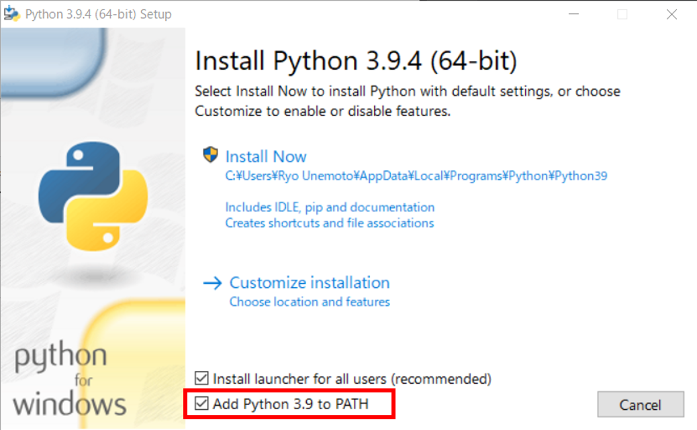

# Viva Web-Scrapper

## Como usarlo

### 1. Instalar Python en la computadora

El interprete de Python  puede ser descargado a través de su [página de internet](https://www.python.org/downloads/) para ser instalado en Windows, macOs o Linux.

**Asegurarse de añadir Python al PATH.**



### 2. Crear un entorno virtual

Una vez instalado Python, correr este commando con una dirección en la computadora.

```
python -m venv /path/to/new/virtual/environment
```

### 3. Activar entorno virtual

Ejecutar alguno de los commandos para activar el entorno virtual en Windows.

| Windows | Comando para activar el entorno virtual  |
| ------- | ---------------------------------------  |
| cmd.exe    | *<venv\>*\Scripts\activate.bat |
| PowerShell | *<venv\>*\Scripts\Activate.ps1 |

Ejecutar alguno de los commandos para activar el entorno virtual en macOs o Linux.

| UNIX | Comando para activar el entorno virtual   |
| ---- | ---------------------------------------   |
| bash/zsh   | **source** *<venv\>*/bin/activate         |
| fish       | **source** *<venv\>*/bin/activate.fish    |
| csh/tcsh   | **source** *<venv\>*/bin/activate.csh     |
| PowerShell | *<venv\>*/bin/Activate.ps1            |

### 4. Instalar librería Selenium

Una vez activado el entorno virtual, correr este commando para instalar Selenium.

```
pip install selenium
```

### 5. Instalar Google Chrome

El explorador de Google Chrome se puede descargar directamente desde de su [página de internet](https://www.google.com/chrome/) para Windows/macOs/Linux.

### 6. Instalar ChromeDriver

Este paso es muy importante para el buen funcionamiento del programa, se debe installar el [driver de Chrome](https://chromedriver.chromium.org/). Y debe ser añadido al PATH.

*Para saber las direcciones de PATH ejecutar el commando:*

| cmd.exe | PowerShell | sh |
| ------ | ----------- | -- |
| echo %PATH% | $env:PATH | echo $PATH |

### 7. Ejecutar programa

- **Opcion 1. Descargar el programa y ejecutarlo**

   Para esto, puedes guardar (Ctrl+S) el [archivo raw de viva-scrapper.py](https://raw.githubusercontent.com/shyguyCreate/viva-scrapper/main/viva-scrapper.py) y guardar el archivo en cualquier lugar.

- **Opcion 2. Clonar este repositorio ejecutar el archivo**

   Si tienes `git` instalado puedes ejecutar este comando:

   ```
   git clone https://github.com/shyguyCreate/viva-scrapper.git
   ```

Ya cuando se tenga el archivo en la computadora, correr este commando con la dirección que tenga el archivo:

```
python /path/to/file/viva-scrapper.py
```
